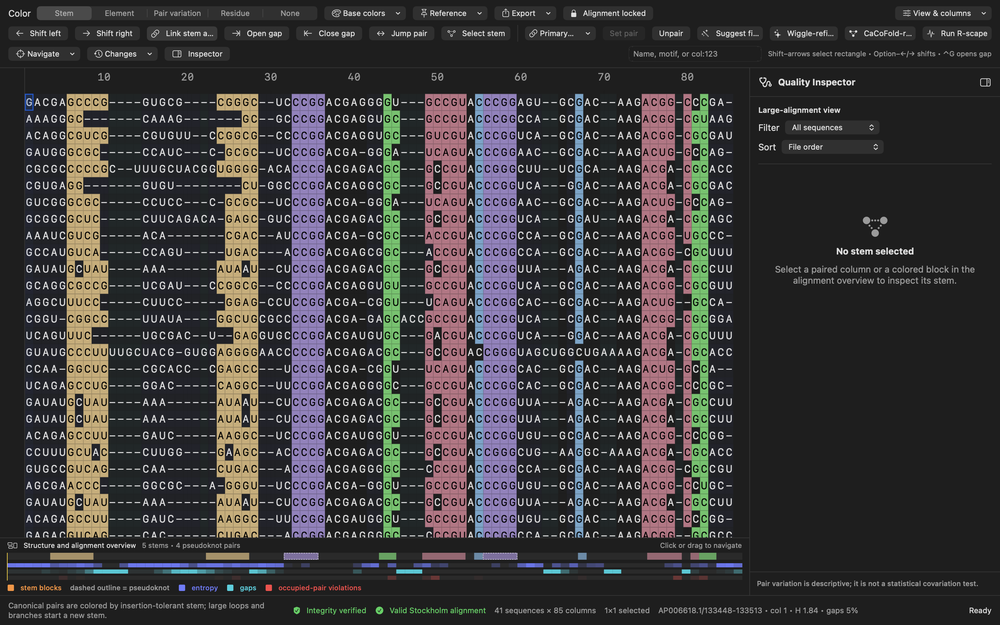

# MATER for macOS


**MATER — Manual Alignment Tool for Evolutionary RNA** is a native, structure-aware Stockholm alignment editor designed for fast manual RNA alignment curation on macOS.



## Install

1. Download `MATER-0.9.1-macOS-universal.zip` from the [v0.9.1 private-alpha release](https://github.com/clangeberg/MATER/releases/tag/v0.9.1).
2. Unzip it and drag `MATER.app` into Applications.
3. On first launch, right-click the app and choose **Open**. If macOS still blocks it, allow MATER under **System Settings → Privacy & Security** and open it again.

MATER supports macOS 13 or newer on Apple-silicon and Intel Macs. The release is ad-hoc signed but not Apple-notarized.

## Documentation and examples

- Read the [complete MATER User Guide](docs/MATER-User-Guide.md) for tutorials, every editor and analysis feature, calculation methods, shortcuts, workflows, limitations, and troubleshooting.
- Open the [Rfam teaching alignments](Examples/Rfam/README.md) to try two pseudoknotted riboswitches, one non-pseudoknotted riboswitch, and a selenocysteine tRNA alignment.

## Current features

- Native macOS document GUI for `.sto`, `.stk`, and `.stockholm` files
- Preservation of Stockholm metadata and comments; single-block files round-trip exactly, while wrapped/interleaved aligned rows are safely normalized into one complete row on save
- Duplicate sequence names are retained as separate rows and reported as validation errors instead of being mistaken for wrapped continuations
- Editable sequence, `#=GC`, and `#=GR` alignment rows
- Atomic sequence-plus-`#=GR` gap movement: PP, SS, and other per-residue annotations follow the same residue permutation through shifts, gap opening/closing, suggestions, paste, reversion, and Wiggle-refine
- Live insertion-tolerant stem coloring across every `SS_cons*` layer, with one- and two-column bulges retained in the same stem and noncanonical pairs left uncolored
- Optional **Element** coloring that follows a continuous helix through arbitrarily large bulges and internal loops, splitting only at true branch junctions, disjoint helices, or different WUSS pairing classes
- WUSS/Rfam pairs: `<>`, `()`, `[]`, `{}`, and `A/a` through `Z/z`
- Descriptive pair-variation coloring for same-pair, one-sided, two-sided, invalid, and gapped observations
- Residue coloring
- User-configurable, persistent colors for A, C, G, and U/T
- Automatic highlighting of the selected nucleotide's structural partner
- Double-click pair selection and triple-click full-stem selection
- Rectangular multi-sequence editing, shifting, clearing, copying, and pasting
- Single-sequence gap opening and closing without changing alignment width
- Optional pinned reference sequence
- R2R-compatible, GSC-weighted consensus (`A/C/G/U`, `R/Y`, lowercase `n`, or `-`) in a compact row directly above the analysis plots
- Exact duplicate-pattern collapsing for the GSC guide tree, preserving relative consensus weights while accelerating redundant deep alignments
- Strong whole-column highlighting when selecting the calculated consensus or a `#=GC SS_cons*`, `RF`, or `cons` cell
- Enabled-by-default Alignment Integrity mode that protects ordered ungapped sequence data during editing and verifies it again before saving
- Prominent save protection for malformed Stockholm documents; invalid output requires an explicit, warned per-document override
- Explicit sequence-editing unlock for intentional residue corrections, with persistent comparison against the opened file
- Collapsible Structural Quality Inspector with per-stem support metrics, residue-pair counts, pair-by-pair summaries, and clickable observations
- Gap-only suggested stem fixes that optimize both complete helix arms plus up to three neighboring unpaired columns, with before/after previews and structural/profile scoring
- One-click **Wiggle-refine** that iterates safe coordinated helix-arm and neighboring gap improvements to a local fixed point, reports pass/sequence/edit progress, can be cancelled, writes a new Stockholm file, and leaves the source untouched
- Optional **CaCoFold-refine** through a separately installed R-scape, retaining only the improved Stockholm alignment while discarding intermediate analysis products
- Optional R-scape evaluate-given-structure (`-s`) integration with retained `.cov` and `.power` tables that open directly in TextEdit, an R2R PDF/SVG drawing, and a closable zoomable PDFKit preview inside MATER; executable, `bin`, and installation-folder selection are supported
- Display-only sequence filtering and sorting by selected-stem pairing violations, name, violation count, or alignment-wide gap fraction
- Column-aligned structure overview with matching colored blocks for each stem arm and dashed outlines for pseudoknots
- Combined structure/entropy/gap/pair-violation overview for direct comparison and rapid navigation across large alignments
- Pair-violation rates calculated only from occupied, unambiguous pairs; gapped and ambiguous observations are excluded rather than treated as structural failures
- `#=GR … PP` and `#=GC PP_cons` rows hidden by default without changing the file
- Live per-column Shannon entropy bar plot (0–2 bits), shown by default
- Live gap-frequency plot, interactive plot columns, and adjustable analysis thresholds
- Search by sequence name, motif, or alignment column
- Navigation among noncanonical pairs, high-entropy columns, gap-rich columns, and validation problems
- Per-file rolling recovery snapshots, 30-day cleanup, user-controlled recovery clearing, changed-cell highlighting, and baseline region/row reversion
- Privacy-safe **Copy Diagnostics** output with app/OS/alignment/validation/R-scape context but no sequence or annotation contents
- Full-alignment vector export to PDF or SVG using the current colors and display options, including the R2R consensus row when visible
- Export titles, legends, numbering intervals, adjustable name width, selected rows/columns, and tiled multi-page PDF
- Stable tiled-PDF composition that retains PDFKit source pages through final rendering
- Shift selected residues left/right into adjacent gaps, automatically expanding a single structural base to its complete stem arm
- Optionally shift both paired stem arms together in opposite directions to keep the helix in register
- Jump between paired columns
- Create and remove primary or pseudoknot pairs
- Insert alignment-wide gap columns, delete one all-gap column, or remove every all-gap column at once
- Revision-based rendering caches for responsive navigation and coloring
- Undo/redo, copy/paste, validation, and round-trip saving
- Native About, Settings, and Help commands; persistent residue colors and R-scape location are managed in Settings

## Build

Run:

```bash
./scripts/build-app.sh
```

The double-clickable universal app is created at `dist/MATER.app`, supports both Apple-silicon and Intel Macs, and is ad-hoc signed for local use.

MATER 0.9.1 is built and tested with Swift 5.10 or newer and the matching macOS SDK supplied by Xcode Command Line Tools. To select a non-active SDK explicitly, set `MATER_SDK_PATH=/path/to/MacOSX.sdk` for the build or test command.

Run the regression suite with:

```bash
./scripts/run-core-tests.sh
```

Run deterministic randomized edit properties and the quick/full offscreen GUI matrices with:

```bash
./scripts/run-property-tests.sh
./scripts/run-gui-stress-tests.sh --quick
./scripts/run-gui-stress-tests.sh
```

An opt-in current-Rfam corpus audit downloads the public SEED archive into the ignored `.build` cache and checks 250 evenly sampled families by default:

```bash
./scripts/audit-rfam-corpus.sh 250
```

Audit the included Rfam examples with:

```bash
./scripts/run-core-tests.sh Examples/Rfam/*.sto
```

Run the reproducible large-alignment benchmark with:

```bash
./scripts/benchmark-performance.sh 5000 1000
```

Tagged pushes are tested and packaged by the macOS GitHub Actions workflow. Release ZIPs are accompanied by a SHA-256 file.

MATER source code is available under the [BSD 3-Clause License](LICENSE). Citation metadata is provided in [CITATION.cff](CITATION.cff), and local-data behavior is documented in the [privacy statement](PRIVACY.md).

## Core editing controls

- Click or drag to select cells; Shift-click or Shift–arrows extends a rectangular selection.
- Double-click a paired cell to select both partners; triple-click it to select its entire stem.
- Click or drag in `SS_cons*`, `RF`, `cons`, or the calculated R2R consensus row to highlight complete alignment columns.
- Choose **Stem** colors for fine insertion-tolerant stacks or **Element** colors for continuous high-level helices across bulges and internal loops; true branches and separate pairing classes receive distinct colors.
- Keep **Alignment locked** for normal curation. Gap movement and annotations remain editable, while residue replacement, insertion, deletion, and sequence reordering are protected.
- Select a stem to populate the **Quality Inspector**; click a reported problem to jump to that sequence and pair.
- Use **Suggest fixes** to preview width-preserving gap arrangements across both helix arms and their ±3-column unpaired neighborhoods without changing ungapped residues.
- Use **Wiggle-refine** to scan every sequence and annotated stem, write a uniquely named `*-MATER-wiggle-refined.sto`, and open it in MATER without approving individual edits. The button displays progress and becomes a cancel button while running. Wiggle-refinement never decreases total canonical support or increases definite noncanonical observations; gaps are not treated as failures.
- Use **CaCoFold-refine** to run an installed R-scape in evaluate-given-structure CaCoFold mode, write only `*-MATER-CaCoFold-refined.sto`, and open that result in MATER. The original alignment and the separate **Run R-scape** statistical-results workflow are unchanged.
- Use **Run R-scape** to evaluate the current `SS_cons*` structure with an installed R-scape. Finder apps may not inherit Terminal's PATH; **Locate R-scape…** accepts the executable, `bin` folder, or installation folder and prefers the installed copy beside R2R. MATER also supplies a private writable working directory for R-scape's internal FastTree files.
- Click or drag in the combined structure and analysis overview to navigate long alignments; matching block colors identify paired stem arms.
- Type an IUPAC nucleotide to replace selected sequence cells.
- Delete replaces sequence cells with `-` and annotation cells with `.`.
- Option–Left/Right shifts the selected block into adjacent gaps. On a single paired base, it automatically shifts that complete stem arm.
- Keep **Link stem arms** enabled to move the paired arm one column in the opposite direction during a stem-arm shift; turn it off to move only the selected arm.
- Control-G opens a gap before the cursor; Control-Shift-G closes the selected gap.
- Command-C/V copies or overwrites an alignment segment.
- Command-F focuses search; enter a sequence name, motif, number, or `col:123`.
- Select two or more columns and use **Set pair** to annotate the endpoints in the chosen structure layer.
- Use **Navigate** to jump directly among analysis and structural problems.
- Use **Changes** to compare against the opened file, revert a region or row, manage recovery snapshots, or copy a privacy-safe diagnostic report.
- Use **Export** to save the complete or selected colored alignment as vector PDF or SVG.
- Use **View & columns** to insert or remove gap columns, show PP rows, toggle the R2R consensus, combined overview or inspector, configure plots, and adjust thresholds.
- Use **MATER → Settings** to change residue colors, locate R-scape, or clear recovery data, and **Help → MATER User Guide** for the version-matched manual bundled with the app.

The original file is not modified until you save. Keep versioned copies of important alignments while this early build is being validated.

## Feedback

Bug reports and focused feature requests are welcome through the structured [GitHub Issues](https://github.com/clangeberg/MATER/issues) forms. Use **Changes → Copy Diagnostics** and, when possible, include a minimal Stockholm example that reproduces the behavior; remove unpublished biological data first.
