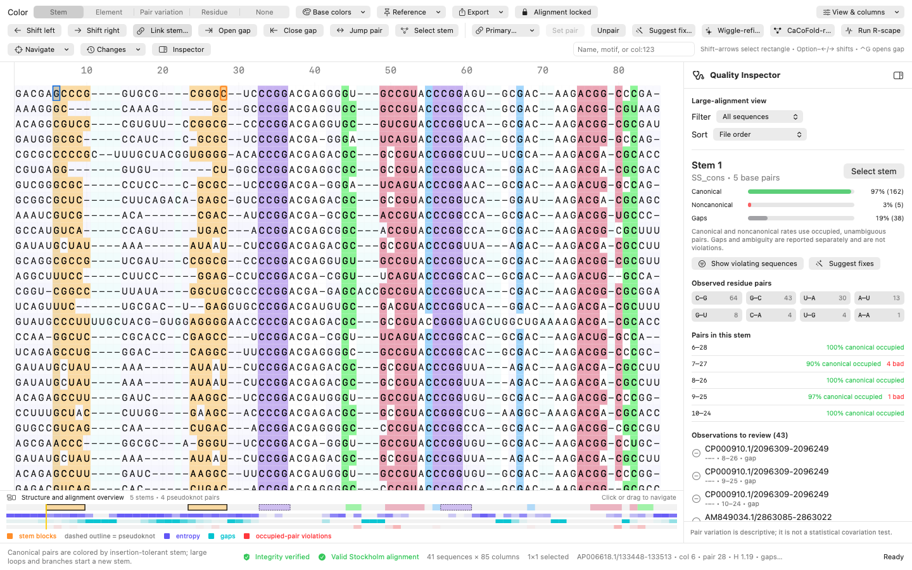

# MATER for macOS


**MATER — Manual Alignment Tool for Evolutionary RNA** is a structure-aware Stockholm alignment editor for macOS.



MATER supports manual RNA alignment refinement by keeping gap movement, sequence conservation, and base-pairing in a single view. It is particularly useful for alignments with pseudoknots, which are difficult to follow in a conventional text editor.

MATER complements Infernal, R2R, and R-scape rather than replacing them. Its scope is focused manual editing.

## Core capabilities

- Opening, editing, validating, and saving Stockholm (`.sto`, `.stk`, and `.stockholm`) alignments
- Coloring canonical pairs by stem or by larger structural element, including pseudoknots
- Switching between structural colors and user-defined A/C/G/U colors
- Highlighting paired columns and moving one or both helix arms together
- Protecting ungapped sequence order and keeping `#=GR` annotations registered with their sequences
- Showing R2R-style consensus, entropy, gap frequency, and occupied-pair violation tracks directly under the alignment
- Suggesting local gap-only improvements or refining the alignment with **Wiggle-refine**
- Running optional R-scape and CaCoFold workflows when R-scape is installed separately
- Exporting the colored alignment as PDF or SVG

The [MATER User Guide](docs/MATER-User-Guide.md) covers every control, keyboard shortcut, calculation, file-safety rule, and known limitation.

## Install

1. Download `MATER-1.0.0-macOS-universal.zip` from the [MATER 1.0.0 release](https://github.com/clangeberg/MATER/releases/tag/v1.0.0).
2. Unzip it and drag `MATER.app` into Applications.
3. Open a Stockholm file from MATER or double-click it in Finder.

MATER supports macOS 13 or newer on Apple-silicon and Intel Macs.

The downloadable app is ad-hoc signed, but it is not Apple-notarized. macOS may therefore block the first launch. Try right-clicking MATER and choosing **Open**, or allow it under **System Settings → Privacy & Security**. If macOS reports that the verified release download is damaged, remove the quarantine attribute with:

```bash
xattr -d com.apple.quarantine /Applications/MATER.app
```

This command should only be used for a copy downloaded from the repository's official release page.

## Basic workflow

Open a Stockholm alignment and leave **Alignment locked** on. Select bases or whole columns, then use Option–Left/Right to move residues into neighboring gaps. Double-click a paired base to select both partners; triple-click it to select the full stem. **Link stem arms** moves the opposite arm in register.

Use **Stem** colors to distinguish local stacks and **Element** colors to follow a larger helix through bulges or internal loops. Noncanonical pairs are deliberately left uncolored so pairing problems stand out.

The calculated consensus and the structure, entropy, gap, and problem tracks stay aligned with the sequence columns. The problem track measures definite noncanonical pairings among occupied, unambiguous observations; gaps do not count as failures.

For automated help, **Suggest fixes** previews local, gap-only changes. **Wiggle-refine** applies compatible changes across the full alignment and opens the result as a new file. It does not replace residues or alter ungapped sequence order.

## File safety

MATER keeps the original file unchanged until it is saved. Normal curation is gap-only, and Alignment Integrity mode checks that ungapped residues and per-residue annotations remain in order. Malformed output is blocked unless the warning is explicitly overridden.

Versioned copies of important alignments are recommended, especially when MATER is first introduced into an existing workflow.

## R-scape and CaCoFold

R-scape is optional and is not bundled with MATER. MATER will usually find an installation available on the Terminal `PATH`. Finder-launched apps do not always inherit the same `PATH`, so **MATER → Settings → Locate R-scape…** also accepts the executable, its `bin` folder, or the R-scape installation folder.

**Run R-scape** evaluates the supplied structure and keeps the useful pairwise tables and R2R drawing. **CaCoFold-refine** produces an improved Stockholm alignment and opens it in MATER. If R-scape is unavailable or fails, MATER reports the problem without closing or changing the open alignment.

## Examples and documentation

- [Complete user guide](docs/MATER-User-Guide.md)
- [Rfam teaching alignments](Examples/Rfam/README.md): two pseudoknotted riboswitches, one riboswitch without a pseudoknot, and a selenocysteine tRNA alignment
- [Release history](CHANGELOG.md)
- [Local-data privacy statement](PRIVACY.md)

## Build and test

MATER is a native Swift application. Build the universal app with:

```bash
./scripts/build-app.sh
```

Run the main regression, randomized-edit, and GUI checks with:

```bash
./scripts/run-core-tests.sh
./scripts/run-property-tests.sh
./scripts/run-gui-stress-tests.sh --quick
```

The build uses Swift 5.10 or newer and the matching macOS SDK from Xcode Command Line Tools. The full set of build, audit, benchmark, and packaging commands is described in [scripts/README.md](scripts/README.md).

## Scope

MATER currently edits one Stockholm alignment per window. It does not realign sequences, infer a new structure on its own, or turn descriptive pair variation into a statistical covariation result. Those jobs remain with dedicated tools. The optional R-scape integration is the statistical path provided by MATER.

The compact structural-problem heatmap is intentionally a screen-only navigation aid and is not included in PDF or SVG exports.

## Citation, license, and feedback

Citation metadata is in [CITATION.cff](CITATION.cff). MATER is available under the [BSD 3-Clause License](LICENSE).

Bug reports and focused feature requests are welcome through [GitHub Issues](https://github.com/clangeberg/MATER/issues). **Changes → Copy Diagnostics** produces a report without copying sequence or annotation contents. A small reproducible Stockholm example is especially helpful; unpublished biological data should be removed first.
